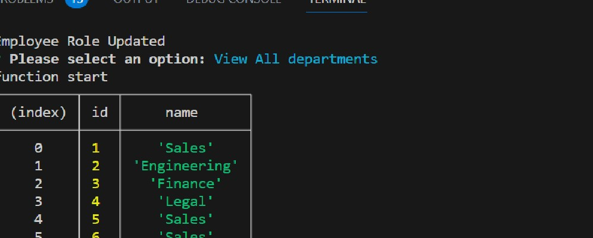
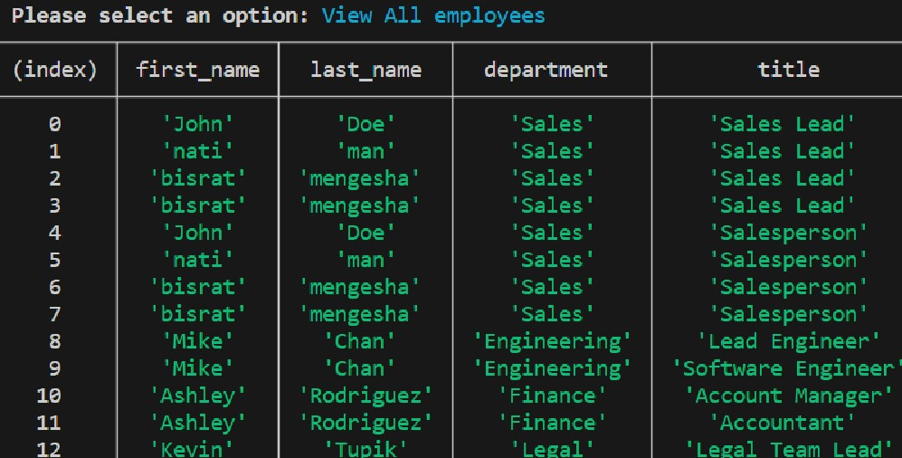
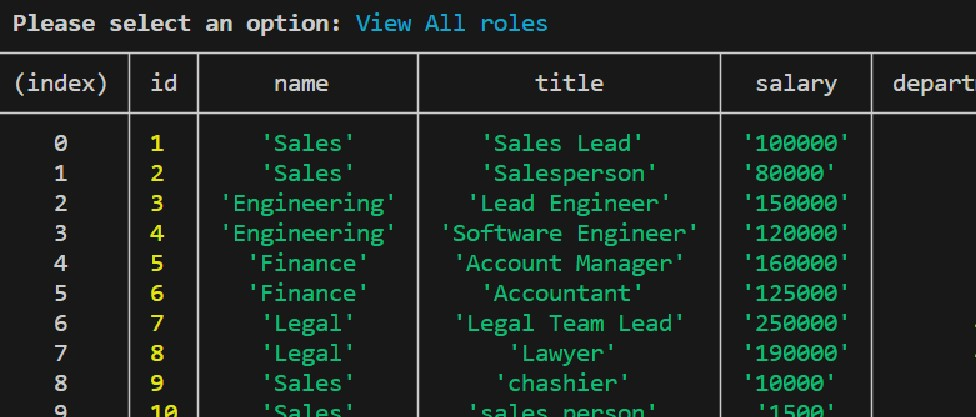

# EmployeeTracker

<bisrat>

employe tracker

discription
this employe tracker accept user input from prompt and present data from the database using query method
writen in js
it uses different npm packages like
inquieries, mysql, and node

i use join function to get mixed tables

use forign key rule to make relation ship between tables

using msql2 module i connect my javascript with the database

sample picture taken from terminal
;

clone git@github.com:Hellobisrat/EmployeeTracker.git

githublink https://github.com/Hellobisrat/EmployeeTracker

video link https://drive.google.com/file/d/14EMgNWLZ-UgiaDqFQEX-_cGjEY5UOqEu/view

https://drive.google.com/file/d/14EMgNWLZ-UgiaDqFQEX-_cGjEY5UOqEu/view

